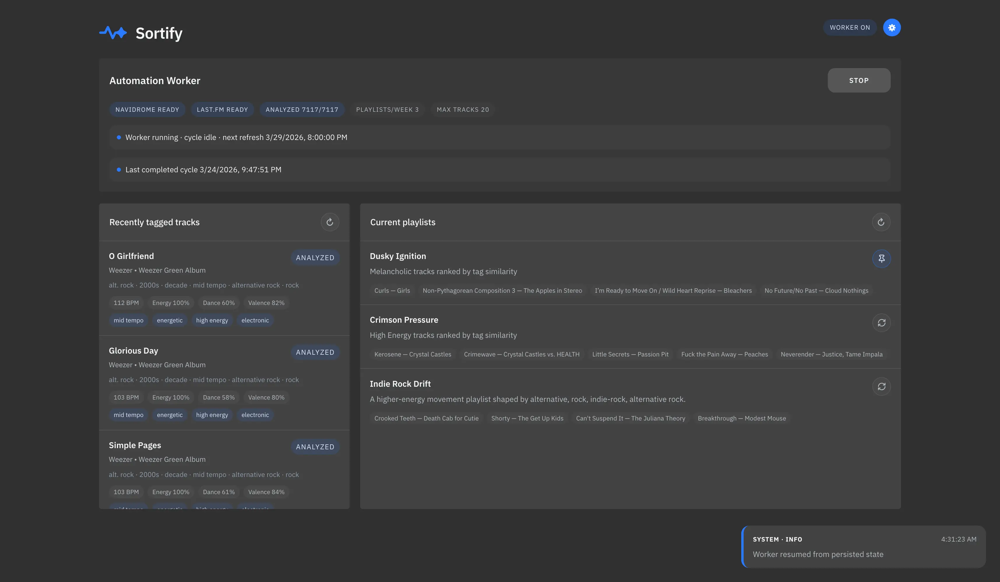

<p align="center">
  
</p>

# Sortify

It's is a self-hosted playlist assistant for Navidrome. It scans your library, stores metadata locally, and generates recommended playlists from the web UI. It does NOT touch your files metadata and instead stores it in a local SQLite database, keeping your files safe and untouched.

## Screenshot



## Requirements

- Navidrome
- Last.FM API key

## Docker build

```
services:
  sortify:
    image: "ghcr.io/lklynet/sortify:latest"
    container_name: sortify
    ports:
      - "3001:3001"
    restart: unless-stopped
    volumes:
      - ./data:/data
```

Change `./data` if you want data to persist through container restarts.

## Configuration

All settings can be updated via the app UI. It supports these environment variables:

- `PORT`
- `SUBSONIC_URL`
- `SUBSONIC_USER`
- `SUBSONIC_PASSWORD`
- `LASTFM_API_KEY`
- `MAX_TRACKS_PER_PLAYLIST`

## Playlist modes

In the **Current playlists** panel, the mode button is icon-only. Clicking it cycles through:

- **↻ Weekly (dynamic):** replaced by Sortify on refresh cycles.
- **📌 Pinned:** keeps the playlist in place, but refreshes its tracks.
- **🔒 Locked:** keeps the playlist exactly as-is, with no automatic changes.

## License

AGPL-3.0-or-later
